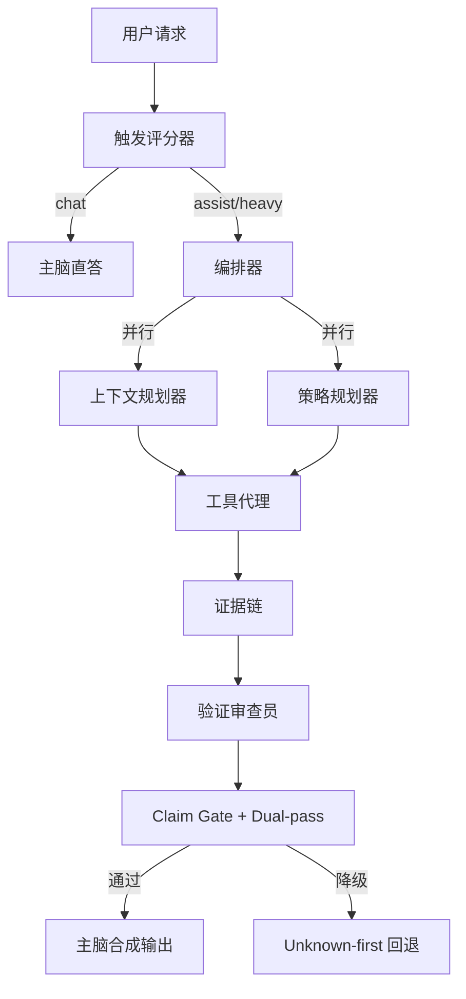

# V1.6 最终设计稿：单 Session 主脑 + 小脑（DeepSeek 增强版）

> 状态：Final Draft（可执行）
> 日期：2026-02-08
> 基线分支：`feature/opencode-custom`
> 适用范围：`packages/opencode` 单会话编排内核

---

## 1. 文档目的与输入来源

本稿用于收敛 V1.6 的最终实现方向，统一产品目标、架构决策、门禁指标和发布路径。

本稿合并三类输入：

1. 现有共创草案：
   - `docs/plans/2026-02-08-v1_6-capability-enhancement-co-creation-draft.md`
2. 世界级方案选项（含新增设计）：
   - `docs/plans/2026-02-08-v1_6-world-class-enhancement-options.md`
   - `docs/plans/2026-02-08-v1_6-world-class-enhancement-options_zh.md`
3. DeepSeek 官方能力与约束（截至 2026-02-08）：
   - [Thinking Mode](https://api-docs.deepseek.com/guides/thinking_mode)
   - [Tool Calls](https://api-docs.deepseek.com/guides/tool_calls)
   - [Context Caching (zh-CN)](https://api-docs.deepseek.com/zh-cn/guides/kv_cache)
   - [Context Caching (EN)](https://api-docs.deepseek.com/guides/kv_cache/)
   - [Models & Pricing](https://api-docs.deepseek.com/quick_start/pricing/)
   - [Change Log](https://api-docs.deepseek.com/updates/)

---

## 2. V1.6 总目标（产品版）

在不做模型微调、仅靠工程编排的前提下，把单会话能力从“能用”升级到“可商用”：

- 成功率更高：复杂任务更容易一次做对。
- 能力上限更高：主脑可以稳定借力 2~3 个小脑，而不是单点硬扛。
- 幻觉更低：证据不足时优先降级为 unknown-first，不强答。
- 过程可见：用户在 TUI/GUI 能稳定看见“分析/检索/验证”等阶段，不泄露思维细节。
- 成本可控：按风险弹性启用小脑，使用缓存降低重复上下文成本。

---

## 3. 关键结论（最终决策）

### 3.1 方案选择

采用“方案 B（指挥家）”作为 V1.6 默认主线：

- 小脑能力：3 个 worker 全部支持 LLM 路径。
- 安全兜底：每个 worker 都保留规则回退。
- 触发策略：按风险/复杂度评分弹性启用，不全时常开。
- 质量闭环：Claim Graph + Dual-pass + Evidence Gate 统一门控。

### 3.2 单 Session 优先，分形作为扩展

- V1.6 交付边界：先把“单 Session 原子认知单元”做到生产可用。
- 多 Session 分形协同：作为后续扩展能力，不作为 V1.6 上线阻塞项。

### 3.3 小脑角色固定（产品语义）

1. 上下文规划器（Context Planner，原 `retrieval_planner`）
2. 策略规划器（Strategy Planner，原 `patch_planner`）
3. 验证审查员（Verification Critic，原 `evidence_critic`）

### 3.4 “黄金三角”职责汲取（来自 world-class 方案）

- W1 上下文规划器（侦察兵）：负责把“用户目标 -> 检索请求”结构化，提升输入质量，避免主脑盲搜。
- W2 策略规划器（建筑师）：只产行动计划，不产直接执行内容，降低主脑在复杂任务中的结构性失误。
- W3 验证审查员（审计员）：对齐 claim 与 evidence，拦截无证据论断，触发 unknown-first 降级。

### 3.5 “分形架构”汲取与边界

- 已汲取：把“主脑 + 3 小脑”定义为可复用原子内核，后续可复用于 root session 与 sub-session。
- 本版边界：V1.6 必须先完成单 Session 商用品质闭环；多 Session 分形协作作为 V1.7 候选增强，不阻塞 V1.6 发布。
- 兼容要求：V1.6 内核在协议与事件层保持可嵌套，不引入只能单实例运行的硬编码假设。

---

## 4. 目标架构（单 Session）

设计原则：

- 并行优先：W1/W2 并行，W3 在证据回填后执行。
- 强约束：策略规划器只产“计划文本”，不直接产可执行代码。
- 证据优先：关键 claim 无证据，必须降级或请求补充。

---

## 5. 触发与预算策略（V1.6）

### 5.1 评分输入

评分器输入字段：

- `complexity_score`：任务复杂度（多约束、多步依赖、多文件上下文）
- `risk_score`：错误代价（事实性、法律/财务/生产变更风险）
- `tool_need_score`：是否必须依赖外部工具/证据
- `latency_budget`：当前可用时延预算

### 5.2 模式路由

- `chat`：低风险低复杂度，0 worker
- `assist`：中等复杂或中等风险，2 worker（W1 + W3）
- `heavy`：高复杂或高风险，3 worker（W1 + W2 + W3）

### 5.3 预算守卫

- 单 worker 默认超时：1500ms（可按模型档位微调）
- 单 turn worker 总预算：不超过 turn 延时预算的 25%
- Early stop：上下文充足 + 简单读取任务时可跳过 W2
- 连续超预算触发 breaker：自动从 3 worker 退化到 2/1

---

## 6. DeepSeek 专项设计（V1.6 必做）

### 6.1 模型策略

- 主脑默认：`deepseek-chat`（V3.2 非思考）
- 高风险/高复杂阶段：开启 thinking
  - 方式 A：切 `deepseek-reasoner`
  - 方式 B：`deepseek-chat` + `thinking: {"type":"enabled"}`
- 小脑默认使用小快模型；高风险路径允许把 W3 升档到 thinking 模式

### 6.2 Thinking + Tool Calls 协议规则

根据官方 thinking mode 指南：

- 在同一问题的工具调用链中，必须按子请求回传 `reasoning_content`，否则可能 400。
- 新用户问题开始时，历史 `reasoning_content` 应清理，仅保留 `content`/工具消息。
- thinking 模式下 `temperature`/`top_p` 等参数即使设置也不生效；`logprobs` 类参数会报错。

工程落地规则：

1. 对“同一 turn 内”tool loop，保留并回传 `reasoning_content`。
2. 对“下一轮用户 turn”，执行 `reasoning_content` 清理。
3. 观测层默认不展示原始 `reasoning_content`，仅展示阶段状态与结果摘要。

### 6.3 上下文缓存放大策略

根据官方 Context Caching：

- 只匹配重复前缀，缓存默认启用。
- 缓存按 64-token 块生效；小于 64 token 不缓存。
- 命中是 best-effort，不保证 100%。
- 关键监控字段：`prompt_cache_hit_tokens`、`prompt_cache_miss_tokens`。

V1.6 约束：

1. Prompt 结构重排：稳定系统前缀/工具契约前置，动态用户尾部后置。
2. 新增指标：`cache_hit_ratio = hit / (hit + miss)`。
3. 离线评测和线上观测同时纳入缓存命中率统计。

---

## 7. 可观测与安全展示（TUI/GUI）

### 7.1 用户可见语义（非工程术语）

展示阶段统一为：

- 分析中
- 检索中
- 规划中
- 验证中
- 已降级（需要更多证据）

### 7.2 展示红线

- 默认不展示 chain-of-thought 原文。
- 默认不展示原始模型异常栈。
- 显示 reason code + 脱敏摘要 + 建议下一步。

### 7.3 稳定性修复要求（P0）

- worker 生命周期事件必须绑定到正确 `messageId`。
- “unknown message” 事件在 TUI/GUI 解析层必须可回收或兜底展示。

---

## 8. 指标与发布门禁（最终版）

### 8.1 质量指标

- `unsupported_claim_rate` < 5%
- `unknown_precision` > 90%
- `task_completion` > 85%

### 8.2 性能与成本指标

- `p95_latency` < 4s（或不超过基线 1.2x）
- `cost_per_success` 持续下降（结合缓存命中率评估）
- `cache_hit_ratio` 环比提升（至少在长上下文场景）

### 8.3 阻断门禁

上线默认开启前，必须满足：

1. Worker 触发正确率（简单问答误触发率受控）
2. 证据门控误杀率受控（关键任务不被过度拒答）
3. Offline-eval（legal/sales + 现有 coding 套件）全部通过
4. TUI/GUI 小脑过程稳定可见（无明显丢事件）

---

## 9. 里程碑实施（M1~M5）

### M1 可观测稳定化（先做）

- 目标：用户稳定看见小脑过程，不泄密
- 交付：事件绑定修复 + UI 阶段文案 + 调试开关

### M2 双规划器 LLM 化

- 目标：`retrieval_planner` / `patch_planner` 从 stub 升级为 LLM + fallback
- 交付：结构化输出、预算守卫、回退策略

### M3 评分触发器

- 目标：替代硬编码启发式
- 交付：score pipeline + 路由策略 + 离线校准

### M4 DeepSeek 能力放大

- 目标：thinking/tool loop/context caching 完整纳入编排
- 交付：协议修复、缓存观测、模型档位策略

### M5 默认开启与灰度收口

- 目标：移除实验性不稳定路径，形成发布基线
- 交付：发布报告、回滚预案、阈值固化

---

## 10. Feature Flag 规划（建议）

- `OPENCODE_EXPERIMENTAL_ORCHESTRATOR_V16_OBSERVABILITY`
- `OPENCODE_EXPERIMENTAL_ORCHESTRATOR_V16_LLM_WORKERS`
- `OPENCODE_EXPERIMENTAL_ORCHESTRATOR_V16_SCORER`
- `OPENCODE_EXPERIMENTAL_ORCHESTRATOR_V16_DEEPSEEK_THINKING`
- `OPENCODE_EXPERIMENTAL_ORCHESTRATOR_V16_CACHE_AWARE_PROMPT`

启用顺序：`OBSERVABILITY -> LLM_WORKERS -> SCORER -> DEEPSEEK_THINKING -> CACHE_AWARE_PROMPT`。

---

## 11. 风险与缓解

1. 文档冲突风险（reasoning/tool 支持描述不一致）
   - 以官方新版 `thinking_mode` + `tool_calls` 页面为准；旧页仅作历史参考。
2. 时延尖峰风险
   - 并行 + 超时 + breaker + 早停。
3. 成本失控风险
   - 动态 worker 启用 + cache-aware prompt + 每会话预算熔断。
4. 过度拒答风险
   - 区分关键/非关键 claim，允许非关键 claim 的部分成功。

---

## 12. 结论

可以形成最终设计稿，并建议以本稿作为 V1.6 统一执行基线：

- 产品目标清晰（成功率 + 能力上限双提升）
- 架构方案收敛（方案 B）
- DeepSeek 特性已内生到协议层和门禁层
- 具备明确可执行里程碑与发布标准

