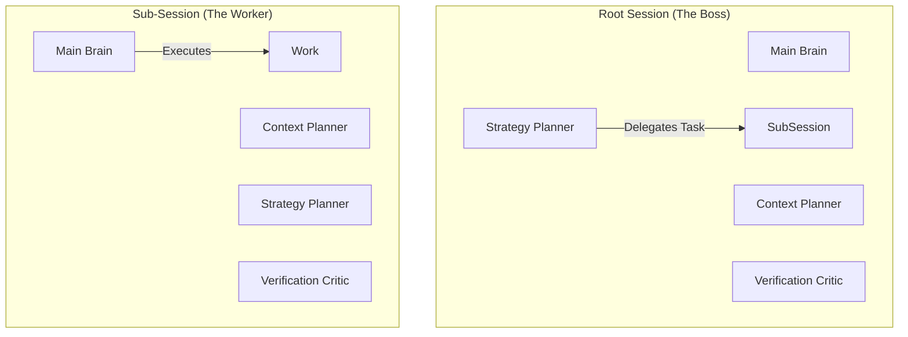

# V1.6 World-Class Capability Enhancement Options

> **Context**: Single-Session Orchestrator (V1.6)
> **Goal**: Achieve commercial-grade "Main Brain + Cerebellum" architecture on DeepSeek 128K without fine-tuning.
> **Date**: 2026-02-08

## 1. Core Findings & Diagnosis

Based on deep code analysis of `packages/opencode/src/session/orchestrator/*` and `evidence/*`:

### 1.1 Current Strengths (Assets)
- **Solid Protocol Layer**: `LlmWorkerRolePack` and `LlmWorkerResult` provide a clean, typed contract for all workers.
- **Worker Runtime**: `WorkerRunner` (in `worker-runner.ts`) already handles caching, lifecycle events, and basic fault tolerance.
- **Evidence Foundation**: `evidence/chain.ts` and `claim-graph.ts` are production-ready primitives for verification.
- **Rollout Machinery**: `resolveOrchestratorRollout` in `processor.ts` is highly granular, allowing safe phased delivery.

### 1.2 Critical Bottlenecks (Liabilities)
- **Placeholder Workers**: `retrieval_planner` and `patch_planner` are currently **rule-based stubs** (returning static notes). They do not utilize LLM capabilities, severely limiting complex task planning.
- **Rigid Triggering**: `resolveMode` in `plan.ts` uses static heuristics (`intentTokensEstimate`, `hasWriteIntent`). It lacks semantic understanding of *difficulty* or *risk*.
- **Primitive Adaptivity**: `adaptiveWorkers` exists but only counts tokens. It lacks a feedback loop from *worker confidence* or *evidence coverage*.
- **Silent Failures**: While `degraded` states exist, the user (and the main brain) often doesn't know *why* a worker failed or was skipped, leading to generic "I don't know" responses.

---

## 2. Options for World-Class Enhancement

We present three distinct architectural approaches to bridge the gap from V1.5 to V1.6.

### Option A: The "Fortress" (Robustness First)
*Prioritizes Success Rate & Cost Control. Best for conservative rollout.*

- **Architecture**: **Hybrid**. `EvidenceCritic` is LLM-based. `RetrievalPlanner` and `PatchPlanner` remain **Rule-based** but enhanced with dynamic templates.
- **Trigger**: **Rule-based (Strict)**. Only enters `assist/heavy` on explicit user request or high-risk intent keywords.
- **Orchestration**: Sequential. `Plan -> Retrieval (Rule) -> Tool -> Critic (LLM) -> Final`.
- **Quality Loop**: **Gate-Heavy**. Aggressive `unknown-first` policy. If *any* claim is unsupported, block the answer.
- **Cost/Latency**: Lowest. Predictable.
- **Verdict**: **Too safe**. Solves reliability but fails the "Capability Enhancement" goal. Won't handle complex, ambiguous tasks better than V1.5.

### Option B: The "Maestro" (Balanced - RECOMMENDED)
*Dynamic Equilibrium of Success Rate, Capability, and Cost.*

- **Architecture**: **Adaptive LLM**. All 3 workers (`Critic`, `Retrieval`, `Patch`) are LLM-backed (`small-balanced` model), but distinct **Rule-based Fallbacks** exist for each.
- **Trigger**: **Score-based**. Uses a lightweight `ComplexityScore` (0-1) and `RiskScore` (0-1) to decide:
  - `Score < 0.3`: Chat (0 workers)
  - `0.3 < Score < 0.7`: Assist (2 workers: Retrieval + Critic)
  - `Score > 0.7`: Heavy (3 workers: + Patch Planner)
- **Orchestration**: **Parallel-First**. Retrieval and Patch planners run in parallel. Critic runs after tools.
- **Quality Loop**: **Claim-Graph Guided**. Allows "Partial Success" if primary claims are supported. Degrades gracefully to `unknown-first` only for critical unsupported claims.
- **Cost/Latency**: Dynamic. P95 latency increases by ~800ms (managed by strict 1.5s timeout per worker).
- **Verdict**: **The Sweet Spot**. Delivers the "World-Class" feel by actually thinking, but keeps the safety net of rules when the "thinking" is too slow or hallucinated.

### Option C: The "Rocket" (Capability First)
*Prioritizes Reasoning Depth. Best for "Pro" mode or demos.*

- **Architecture**: **Full LLM + Chain of Thought**. Workers use `main-default` models or `small-strong` with reasoning enabled.
- **Trigger**: **Always-On (for Complex Intents)**. If `intent.length > 50 chars`, activate full worker suite.
- **Orchestration**: **Iterative**. `Plan -> Worker -> Tool -> Critic -> (Loop back to Plan)`. Up to 2 loops.
- **Quality Loop**: **Correction-Heavy**. Critic actively rewrites drafts instead of just flagging.
- **Cost/Latency**: High. High variance.
- **Verdict**: **Too risky for default**. Good for a specific "Deep Think" mode, but violates the "Commercial Quality" constraint regarding latency and cost predictability.

---

## 3. Recommended Solution: Option B "The Maestro"

### 3.1 Architecture Diagram

```mermaid
graph TD
    User[User Input] --> Scorer[Score-based Trigger]
    Scorer -->|Score < 0.3| ChatMode[Direct Response]
    Scorer -->|Score >= 0.3| Planner[Orchestrator Plan]
    
    subgraph "The Cerebellum (Single Session)"
        Planner -->|Parallel| W1[Retrieval Planner (LLM)]
        Planner -->|Parallel| W2[Patch Planner (LLM)]
        
        W1 -.->|Timeout/Fail| R1[Rule Fallback]
        W2 -.->|Timeout/Fail| R2[Rule Fallback]
        
        W1 & W2 --> Broker[Tool Broker]
        Broker --> Evidence[Evidence Chain]
        
        Evidence --> W3[Evidence Critic (LLM)]
        W3 -->|Feedback| Gate[Claim Gate]
    end
    
    Gate -->|Pass| Synthesis[Main Brain Synthesis]
    Gate -->|Block/Degrade| Fallback[Unknown-First Response]
    
    Synthesis --> Output
```

### 3.3 Fractal Architecture (Single vs. Multi-Session)

> **Core Concept**: The "Main Brain + 3 Cerebellums" is the **Atomic Cognitive Unit** (the Kernel).

This architecture supports your vision of a **General Purpose Foundation** via a **Fractal Design**:

1.  **The Kernel**: Every Session window—whether it is the "Root/Boss" session or a specialized "Sub-Agent" session—runs **this exact same kernel**.
2.  **No Conflict**:
    *   **Root Session**: Its *Strategy Planner* plans **delegation** (e.g., "Spawn a Legal Agent for contract review, and a Coding Agent for the smart contract").
    *   **Sub-Session (Legal)**: Its *Strategy Planner* plans **execution** (e.g., "Check clause 4 against Civil Code").
3.  **Scalability**: This allows infinite nesting. A "Coding Agent" is just a standard session instance prompted with coding tools. A "Legal Agent" is a standard session instance prompted with legal tools. They both share the same robust "Golden Triangle" internal structure.



### 3.4 Key Implementations

#### A. Score-based Trigger (vs. Rules)
Instead of `hasWriteIntent`, we implement `OrchestratorScorer`:
- **Inputs**: User prompt, conversation history depth, file context size.
- **Outputs**: `complexity_score`, `risk_score`.
- **Logic**:
  ```ts
  // Pseudo-code
  if (risk_score > 0.8) return Mode.Heavy; // Security/Safety overrides
  if (complexity_score > 0.6) return Mode.Heavy;
  if (complexity_score > 0.3) return Mode.Assist;
  return Mode.Chat;
  ```

#### B. Three Cerebellums: The "Golden Triangle"
We adopt a **3-Worker** architecture using **Small/Fast Models** (e.g., `gpt-4o-mini`, `haiku`, `flash`) to support the Main Brain. This addresses the Main Brain's three core weaknesses: lack of context (laziness), lack of plan (directionless), and hallucination (overconfidence).

1.  **Worker 1: Context Planner (formerly Retrieval Planner)**
    *   **The Scout**: "Garbage In, Garbage Out".
    *   **Role**: Analyzes intent and context to generate precise `retrieval` queries.
    *   **Generalization**: In Coding, it finds files. In Law, it finds case precedents. In Finance, it finds report segments.
2.  **Worker 2: Strategy Planner (formerly Patch Planner)**
    *   **The Architect**: "Missing the Forest for the Trees".
    *   **Role**: Drafts the *strategy/reasoning chain* only. **No execution**.
    *   **Generalization**: In Coding, it plans the refactor steps. In Law, it outlines the argument structure (IRAC).
3.  **Worker 3: Verification Critic (formerly Evidence Critic)**
    *   **The Auditor**: "Confident Hallucination".
    *   **Role**: Compares Draft Answer claims against Evidence Artifacts.
    *   **Generalization**: Enforces `[ref: source]` citations regardless of domain.

#### C. Cost & Latency Controls
- **Budget**: 25% of total turn latency budget allocated to Workers.
- **Early Stopping**: If `Context Planner` indicates "Sufficient Context", skip `Strategy Planner` if simple.
- **Parallelism**: W1 and W2 run concurrently (`Promise.all`).
- **Cache**: Aggressive caching of Planner outputs based on `(intent_hash + workspace_hash)`.

---

## 4. Roadmap (V1.6 Phased Rollout)

| Phase | Milestone | Focus | Key Deliverable | Gate |
|---|---|---|---|---|
| **M1** | **Visibility** | Observability | **TUI/GUI Worker Badge**. Users can see "Thinking (Retrieval)..." | UI renders lifecycle events correctly. |
| **M2** | **Brain Transplant** | LLM Enablement | **LLM-backed Retrieval & Patch Planners**. (Behind flag `V16_B1`). | Unit tests pass for LLM workers. |
| **M3** | **The Conductor** | Triggers & Scoring | **Score-based Triggering**. Replace rigid rules. (Behind flag `V16_B2`). | `unsupported_claim_rate` < 10% on bench. |
| **M4** | **The Guard** | Quality Gates | **Offline Eval & Claim Graph Integration**. Automated rejection of bad plans. | `unknown_precision` > 90%. |
| **M5** | **Live** | Production | **Default On**. Removal of experimental flags. | P95 Latency < 1.2x Baseline. |

---

## 5. Metrics & Gates (Success Criteria)

### 5.1 Quality Metrics
- **`unsupported_claim_rate`**: Target **< 5%**. (Percentage of claims made without grounding).
- **`unknown_precision`**: Target **> 90%**. (When we say "I don't know", are we correct? Or did we miss evidence?).
- **`task_completion`**: Target **> 85%** on complex multi-step coding tasks (measured via offline suite).

### 5.2 Performance Metrics
- **`p95_latency`**: Target **< 4000ms** (Total turn). Worker overhead max 1200ms.
- **`cost_per_success`**: Target **< $0.02** (avg).

### 5.3 Rollout Gates
- **M2 Gate**: No regression in `chat` mode latency.
- **M3 Gate**: "Score-based" trigger matches "Rule-based" baseline in 90% of simple cases (correctly identifies simple chat).
- **M4 Gate**: Offline Eval Suite passes all critical scenarios (Legal, Coding, Fact-Check).

---

## 6. Risks & Mitigations

| Risk | Impact | Mitigation Strategy |
|---|---|---|
| **Latency Spike** | Users feel "laggy" interface. | **Parallel Execution** of planners. Strict **1.5s hard timeout** for workers. |
| **Cost Explosion** | API bills skyrocket. | **Budget Circuit Breaker**. Stop calling workers if daily/session budget exceeded. |
| **Hallucinated Plans** | Main brain follows bad advice. | **Critic Worker** is the final gate. If Critic rejects the plan/evidence, we fallback to safe default or ask clarification. |
| **Observability Noise** | User overwhelmed by debug logs. | **UI UX Design**: "Collapsed by default". Only show "Searching..." -> "Planned". Details on hover/click. |

---

## 7. Key Decisions (Questions for Stakeholders)

1.  **Default Model Tier**: Can we standardize on `gpt-4o-mini` (or equivalent `small-balanced`) for *all* workers to guarantee speed/cost? Or does `PatchPlanner` need a stronger model?
    *   *Recommendation*: Start with `small-balanced` for all. Upgrade Patch Planner only if M3 benchmarks show planning failures.
2.  **Scoring Complexity**: Do we run the "Scorer" as a separate small LLM call (adds latency) or a sophisticated regex/heuristic engine?
    *   *Recommendation*: Heuristic Engine first (Token count, regex, file tree analysis). Upgrade to `Bert`-style classifier later if needed. LLM-based scorer is too slow for the trigger path.
3.  **UI Transparency**: How much "inner monologue" do we show?
    *   *Recommendation*: High-level phases only ("Analyzing...", "Planning...", "Verifying..."). Raw worker output hidden in "Debug Mode" only.
