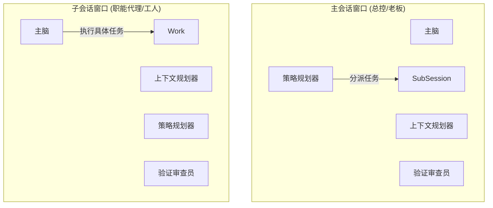

# V1.6 世界级能力增强方案选项 (World-Class Enhancement Options)

> **背景**：单会话编排器 (Single-Session Orchestrator V1.6)
> **目标**：在 DeepSeek 128K + 无微调前提下，实现可商用的“主脑 + 小脑”架构。
> **日期**：2026-02-08

## 1. 核心发现与诊断 (Core Findings & Diagnosis)

基于对 `packages/opencode/src/session/orchestrator/*` 和 `evidence/*` 的深度代码分析：

### 1.1 当前优势 (现有资产)
- **稳固的协议层**：`LlmWorkerRolePack` 和 `LlmWorkerResult` 为所有 worker 提供了清晰、类型安全的契约。
- **Worker 运行时**：`WorkerRunner` (位于 `worker-runner.ts`) 已经处理了缓存、生命周期事件和基础容错。
- **证据基座**：`evidence/chain.ts` 和 `claim-graph.ts` 是已就绪的生产级验证原语。
- **灰度机制**：`processor.ts` 中的 `resolveOrchestratorRollout` 粒度非常细，允许安全的阶段性发布。

### 1.2 关键瓶颈 (现有负债)
- **占位符 Workers**：`retrieval_planner` 和 `patch_planner` 目前只是**基于规则的存根 (Stubs)**（返回静态注释）。它们没有利用 LLM 能力，严重限制了复杂任务的规划能力。
- **触发机制僵化**：`plan.ts` 中的 `resolveMode` 使用静态启发式规则（`intentTokensEstimate`, `hasWriteIntent`）。它缺乏对*难度*或*风险*的语义理解。
- **适应性原始**：`adaptiveWorkers` 虽然存在，但仅统计 token。缺乏来自*worker 置信度*或*证据覆盖率*的反馈闭环。
- **静默失败**：虽然存在 `degraded` 状态，但用户（以及主脑）通常不知道 worker *为什么*失败或被跳过，导致产生通用的“我不知道”回复。

---

## 2. 世界级增强方案选项 (Options)

为了实现从 V1.5 到 V1.6 的跨越，我们提出三种不同的架构路径。

### 方案 A：“堡垒” (The Fortress - 稳健型)
*优先考虑成功率与成本控制。最适合保守发布。*

- **架构**：**混合模式**。`EvidenceCritic` 是基于 LLM 的。`RetrievalPlanner` 和 `PatchPlanner` 保持**基于规则**，但增强了动态模板。
- **触发机制**：**基于规则 (严格)**。仅在用户明确请求或检测到高风险意图时进入 `assist/heavy` 模式。
- **编排**：串行。`Plan -> Retrieval (规则) -> Tool -> Critic (LLM) -> Final`。
- **质量闭环**：**重度门禁**。激进的 `unknown-first` 策略。如果有*任何*论断 (claim) 缺乏支持，直接阻断回答。
- **成本/时延**：最低。可预测。
- **结论**：**过于安全**。解决了可靠性问题，但未能实现“能力增强”的目标。处理复杂、模糊任务的能力不会比 V1.5 更好。

### 方案 B：“指挥家” (The Maestro - 均衡型 / 推荐)
*成功率、能力与成本的动态平衡。*

- **架构**：**自适应 LLM**。所有 3 个 worker (`Critic`, `Retrieval`, `Patch`) 均由 LLM 支持（使用 `small-balanced` 模型），但每个都有独特的**基于规则的回退 (Fallback)** 策略。
- **触发机制**：**基于评分**。使用轻量级 `ComplexityScore` (0-1) 和 `RiskScore` (0-1) 决定：
  - `Score < 0.3`: Chat (0 workers)
  - `0.3 < Score < 0.7`: Assist (2 workers: Retrieval + Critic)
  - `Score > 0.7`: Heavy (3 workers: + Patch Planner)
- **编排**：**并行优先**。Retrieval 和 Patch 规划器并行运行。Critic 在工具执行后运行。
- **质量闭环**：**论断图谱 (Claim-Graph) 引导**。如果主要论断有证据支持，允许“部分成功”。仅对关键未支持论断优雅降级为 `unknown-first`。
- **成本/时延**：动态。P95 时延增加约 800ms（通过每个 worker 严格的 1.5s 超时控制）。
- **结论**：**甜蜜点 (The Sweet Spot)**。通过真正的“思考”提供“世界级”的体感，但在“思考”过慢或出现幻觉时保留规则作为安全网。

### 方案 C：“火箭” (The Rocket - 激进型)
*优先考虑推理深度。最适合“专业 (Pro)”模式或演示。*

- **架构**：**全 LLM + 思维链 (CoT)**。Workers 使用 `main-default` 模型或开启推理的 `small-strong` 模型。
- **触发机制**：**常开 (针对复杂意图)**。如果 `intent.length > 50 chars`，激活完整 worker 套件。
- **编排**：**迭代式**。`Plan -> Worker -> Tool -> Critic -> (Loop back to Plan)`。最多 2 次循环。
- **质量闭环**：**重度修正**。Critic 主动重写草稿，而不仅仅是标记。
- **成本/时延**：高。方差大。
- **结论**：**默认开启风险过大**。适合特定的“深度思考”模式，但违反了关于时延和成本可预测性的“商用品质”约束。

---

## 3. 推荐方案：方案 B“指挥家” (The Maestro)

### 3.1 架构图

```mermaid
graph TD
    User[用户输入] --> Scorer[基于评分的触发器]
    Scorer -->|Score < 0.3| ChatMode[直接回复]
    Scorer -->|Score >= 0.3| Planner[编排器规划]
    
    subgraph "小脑群 (Single Session)"
        Planner -->|并行| W1[检索规划器 (LLM)]
        Planner -->|并行| W2[补丁规划器 (LLM)]
        
        W1 -.->|超时/失败| R1[规则回退]
        W2 -.->|超时/失败| R2[规则回退]
        
        W1 & W2 --> Broker[工具代理]
        Broker --> Evidence[证据链]
        
        Evidence --> W3[证据审查员 (LLM)]
        W3 -->|反馈| Gate[论断门禁]
    end
    
    Gate -->|通过| Synthesis[主脑合成]
    Gate -->|阻断/降级| Fallback[Unknown-First 回复]
    
    Synthesis --> Output
```

### 3.3 分形架构 (单 Session vs 多 Session)

> **核心理念**：“主脑 + 3 小脑”是**原子认知单元 (Atomic Cognitive Unit)**，即“内核”。

该架构通过**分形设计 (Fractal Design)** 完美支持您的“通用基座”与“多智能体协作”愿景：

1.  **统一内核**：每一个 Session 窗口——无论是“总控/老板”窗口，还是分派出去的“子代理/工人”窗口——都运行**完全相同的这套内核**。
2.  **无冲突**：
    *   **主窗口 (Root Session)**：它的 *Strategy Planner* 负责规划**分派策略**（例如：“开一个法律子窗口审合同，开一个代码子窗口写合约”）。
    *   **子窗口 (Sub-Session)**：它的 *Strategy Planner* 负责规划**执行策略**（例如：“根据《民法典》检查第4条”）。
3.  **无限扩展**：这允许无限嵌套。“代码代理”就是一个挂载了代码工具的标准 Session，“法律代理”就是一个挂载了法律数据库的标准 Session。它们内部都拥有稳固的“黄金三角”来保证各自的思考质量。



### 3.4 关键实现

#### A. 基于评分的触发器 (vs. 规则)
代替 `hasWriteIntent`，实现 `OrchestratorScorer`：
- **输入**：用户提示词、对话历史深度、文件上下文大小。
- **输出**：`complexity_score`, `risk_score`。
- **逻辑**：
  ```ts
  // 伪代码
  if (risk_score > 0.8) return Mode.Heavy; // 安全强制覆盖
  if (complexity_score > 0.6) return Mode.Heavy;
  if (complexity_score > 0.3) return Mode.Assist;
  return Mode.Chat;
  ```

#### B. 三小脑：“黄金三角”架构 (The Golden Triangle)
我们采用 **3 Worker** 架构，并强制使用 **小/快模型** (如 `gpt-4o-mini`, `haiku`, `flash`) 来托举主脑。这解决了主脑的三个核心弱点：缺上下文（懒）、缺规划（乱）、幻觉（骗）。

1.  **Worker 1：上下文规划器 (Context Planner - 原检索规划器)**
    *   **角色**：侦察兵 (Scout)。解决“垃圾进，垃圾出”。
    *   **通用职责**：分析意图，生成精确的检索查询。
    *   **泛化场景**：在编程中找文件；在法律中找案例；在财务中找报表。
2.  **Worker 2：策略规划器 (Strategy Planner - 原补丁规划器)**
    *   **角色**：建筑师 (Architect)。解决“只见树木，不见森林”。
    *   **通用职责**：只起草**策略/思维链**，**严禁执行**。
    *   **泛化场景**：在编程中制定重构步骤；在法律中制定辩护逻辑框架 (IRAC)。
3.  **Worker 3：验证审查员 (Verification Critic - 原证据审查员)**
    *   **角色**：审计员 (Auditor)。解决“盲目自信的幻觉”。
    *   **通用职责**：对比草稿回复中的论断 vs 证据工件。
    *   **泛化场景**：无论何种领域，强制要求 `[ref: 来源]`，无证据则拦截。

#### C. 成本与时延控制
- **预算**：总 Turn 时延预算的 25% 分配给 Workers。
- **早停 (Early Stopping)**：如果 `Context Planner` 指示“上下文充足”，且任务简单，则跳过 `Strategy Planner`。
- **并行**：W1 和 W2 并发运行 (`Promise.all`)。
- **缓存**：基于 `(intent_hash + workspace_hash)` 对 Planner 输出进行激进缓存。

---

## 4. 路线图 (V1.6 分阶段落地)

| 阶段 | 里程碑 | 重点 | 关键交付物 | 门禁 |
|---|---|---|---|---|
| **M1** | **可见性** | 可观测性 | **TUI/GUI Worker 徽章**。用户可以看到“思考中 (检索)...”。 | UI 正确渲染生命周期事件。 |
| **M2** | **大脑移植** | LLM 启用 | **基于 LLM 的检索与补丁规划器**。(Flag: `V16_B1`)。 | LLM worker 单元测试通过。 |
| **M3** | **指挥家** | 触发与评分 | **基于评分的触发器**。替换僵化规则。(Flag: `V16_B2`)。 | 基准测试中 `unsupported_claim_rate` < 10%。 |
| **M4** | **守卫** | 质量门禁 | **离线评测 & 论断图谱集成**。自动拒绝糟糕的计划。 | `unknown_precision` > 90%。 |
| **M5** | **Live** | 生产发布 | **默认开启**。移除实验性 Flags。 | P95 时延 < 1.2x 基线。 |

---

## 5. 指标与门禁 (成功标准)

### 5.1 质量指标
- **`unsupported_claim_rate`**：目标 **< 5%**。（无依据做出的论断比例）。
- **`unknown_precision`**：目标 **> 90%**。（当我们说“我不知道”时，我们是对的吗？还是我们错过了证据？）。
- **`task_completion`**：复杂多步编码任务目标 **> 85%**（通过离线套件测量）。

### 5.2 性能指标
- **`p95_latency`**：目标 **< 4000ms** (总 Turn)。Worker 开销最大 1200ms。
- **`cost_per_success`**：目标 **< $0.02** (平均)。

### 5.3 发布门禁
- **M2 门禁**：`chat` 模式时延无回退。
- **M3 门禁**：“基于评分”的触发器在 90% 的简单用例中与“基于规则”的基线匹配（正确识别简单聊天）。
- **M4 门禁**：离线评测套件通过所有关键场景（法律、编码、事实核查）。

---

## 6. 风险与缓解

| 风险 | 影响 | 缓解策略 |
|---|---|---|
| **时延尖峰** | 用户感觉界面“卡顿”。 | 规划器**并行执行**。Worker 严格执行 **1.5s 硬超时**。 |
| **成本爆炸** | API 账单激增。 | **预算熔断器**。如果超过每日/会话预算，停止调用 workers。 |
| **幻觉计划** | 主脑遵循了糟糕的建议。 | **Critic Worker** 是最终门禁。如果 Critic 拒绝计划/证据，我们回退到安全默认值或询问澄清。 |
| **可观测性噪音** | 用户被调试日志淹没。 | **UI/UX 设计**：“默认折叠”。仅显示“搜索中...” -> “已规划”。详情需悬停/点击查看。 |

---

## 7. 关键决策 (需利益相关者确认)

1.  **默认模型档位**：我们可以将所有 workers 标准化为 `gpt-4o-mini` (或同等 `small-balanced`) 以保证速度/成本吗？还是 `PatchPlanner` 需要更强的模型？
    *   *建议*：所有 worker 先从 `small-balanced` 开始。仅当 M3 基准测试显示规划失败时，才升级 Patch Planner。
2.  **评分复杂度**：我们将“评分器”作为一个单独的小型 LLM 调用（增加时延）运行，还是作为一个复杂的正则/启发式引擎运行？
    *   *建议*：先使用启发式引擎（Token 计数、正则、文件树分析）。触发路径上 LLM 评分太慢，以后如有需要再升级为 `Bert` 风格的分类器。
3.  **UI 透明度**：我们要展示多少“内心独白”？
    *   *建议*：仅展示高层阶段（“分析中...”、“规划中...”、“验证中...”）。原始 worker 输出仅在“调试模式”下显示。
