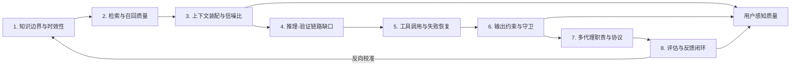

# 通用认知架构与 LLM 弱点根因分析（证据校正版）

> 生成日期：2026-02-10  
> 任务定位：Evidence-first 架构评审与文档纠错  
> 检索范围：论文 / 官方文档 / 权威工程资料  
> 候选来源：26（满足“至少15”）  
> 最终引用高质量来源：24（满足“至少8”）

---

## A. 执行摘要（给决策者）

### A.1 结论先行

1. **“LLM 能力一般”不是单点问题，而是 8 个环节叠加失配**：知识时效、检索召回、上下文装配、推理-验证断裂、工具调用、输出约束、多代理协议、评估闭环。  
2. **现有“主脑 + 小脑”方向是对的，但当前实现卡在“证据契约不完整”**：本地诊断已显示 worker 触发正常，但证据载荷密度低、注入被压缩、末端 guardrail 断层，导致增强不稳定（见本仓库诊断文档）。  
3. **原待校正文档存在“过度绝对化/证据外推”**：尤其是“第一性原理”“最佳形态”“物理必然最优解”等表述，缺乏可验证实证；应改为“工程上更优的可检验假设”。  
4. **短期（P0）应先修“证据主链”而非继续堆编排复杂度**：先把 `retrieval_planner -> evidence_critic -> secure_output` 的结构化协议、重试预算、注入模板做实，再讨论更激进多跳状态机。  

### A.2 事实与推断边界

- **事实（可直接证据化）**：长上下文中间位信息利用下降、时效性失配存在、RAG 与长上下文各有成本性能边界、结构化输出能显著提高 schema 一致性、CoT 不等于 faithful reasoning。  
- **推断（基于事实做工程归纳）**：三小脑并非“唯一正确形态”，但在你当前系统约束下是**高性价比可演进路径**，前提是协议与评估闭环落地。  

---

## B. 根因分析总图（文本 + mermaid）

**解释**：
- 这是闭环系统，不是单点优化问题。  
- 当前瓶颈集中在 `R -> C -> O`（检索质量、注入质量、输出契约）。  

---

## C. 纠错矩阵（逐条指正原文）

> 被纠错文档：`/Users/muqihang/chelingxi_workspace/opencode-zh-build/opencode_src/docs/plans/2026-02-10-general-cognitive-architecture-and-llm-weaknesses.md`

| # | 原主张（位置） | 判定 | 错误原因 | 校正后的表述 | 证据来源 | 置信度 |
|---|---|---|---|---|---|---|
| 1 | “三小脑对应人类复杂认知第一性原理”（§1, 行11） | 证据不足 | 属于哲学化判断，缺乏跨领域对照实证 | 三小脑可视为工程上的高可解释分工模式，不应表述为“第一性原理”定论 | [R19](https://arxiv.org/abs/2308.08155), [R20](https://arxiv.org/abs/2308.00352) | 0.64 |
| 2 | “任何严肃智力工作都必须经历三步骤”（§1, 行13） | 错误（过度绝对化） | “都必须”不可证；不同任务有不同最小流程 | 更稳妥：复杂高风险任务通常需要检索、规划、验证中的至少两环 | [R21](https://arxiv.org/abs/2211.09110), [R23](https://platform.openai.com/docs/guides/evals) | 0.79 |
| 3 | “该架构是通用认知基座最佳形态”（§1, 行21） | 证据不足 | 缺 A/B 对照、缺 benchmark 结果 | 应改为“在当前约束下的候选优先方案，需通过离线/线上评测验证” | [R21](https://arxiv.org/abs/2211.09110), [R22](https://github.com/openai/evals) | 0.73 |
| 4 | “DeepSeek V3 使用 MoE+MLA 且支持 128K”（§2, 行27） | 正确 | 与官方技术材料一致 | 可保留，但建议补充具体来源与日期 | [R3](https://arxiv.org/html/2412.19437v2), [R4](https://github.com/deepseek-ai/DeepSeek-V3) | 0.93 |
| 5 | “仍无法摆脱 Transformer 物理缺陷”（§2, 行27） | 部分正确 | 方向对，但“无法摆脱”过绝对；工程可缓解 | 建议改为“现有长上下文能力仍存在显著退化，需靠检索与约束机制补偿” | [R1](https://arxiv.org/abs/2307.03172), [R2](https://arxiv.org/abs/2404.06654) | 0.83 |
| 6 | “注意力均值随 L 呈 1/L 下降导致中段退化”（§2.1, 行34） | 部分正确 | Softmax 归一化是事实，但中段退化不是单一由 1/L 导出 | 更准确：位置偏置与检索难度共同导致中段性能下降 | [R24](https://arxiv.org/abs/1706.03762), [R1](https://arxiv.org/abs/2307.03172) | 0.82 |
| 7 | “MLA 仅省显存，不能改变注意力稀释”（§2.1, 行36） | 部分正确/证据不足 | “不能改变”缺直接对照实验 | 可改为：MLA主要面向效率与部署；是否改善中段信息利用需专项评测 | [R3](https://arxiv.org/html/2412.19437v2), [R2](https://arxiv.org/abs/2404.06654) | 0.71 |
| 8 | “标准LLM没有草稿纸、不能回头修改”（§2.2, 行42） | 部分正确 | 单次解码自回归是事实，但系统层可引入反思/重写/工具回路 | 更准确：模型原生解码单向，但可通过外部循环与验证链降低单次路径依赖 | [R14](https://arxiv.org/abs/2210.03629), [R12](https://arxiv.org/abs/2309.11495) | 0.86 |
| 9 | “R1主要解决数学逻辑，对工程规划仍缺全局视野”（§2.2, 行43） | 证据不足 | 结论方向可能成立，但缺公开系统性证据 | 可改为：R1在可验证推理任务表现突出；开放式工程规划能力需独立评测 | [R5](https://arxiv.org/abs/2501.12948), [R21](https://arxiv.org/abs/2211.09110) | 0.67 |
| 10 | “幻觉根因是MLE目标”（§2.3, 行47） | 部分正确 | 过度单因果；还受数据时效、检索缺失、验证缺失影响 | 建议改为“MLE目标与证据链缺失共同导致幻觉风险” | [R13](https://arxiv.org/abs/2310.14564), [R8](https://arxiv.org/abs/2005.11401) | 0.88 |
| 11 | “4K精准上下文中 LLM 智商最高”（§3.1, 行60） | 错误/证据不足 | “智商最高”不可测且无统一阈值 | 建议改为“高相关、低噪声上下文通常能提升稳定性与可验证性” | [R1](https://arxiv.org/abs/2307.03172), [R10](https://aclanthology.org/2024.emnlp-industry.66.pdf) | 0.78 |
| 12 | “策略规划与执行分离后，主脑只做填空”（§3.2, 行65） | 部分正确 | 对某些任务成立，但并非普适 | 改为“对可分解任务可显著降低错误传播；对高度耦合任务仍需迭代规划” | [R19](https://arxiv.org/abs/2308.08155), [R20](https://arxiv.org/abs/2308.00352) | 0.74 |
| 13 | “Critic 可直接拦截并强制‘我不知道’”（§3.3, 行70） | 部分正确 | 需要输出契约和守卫协同；当前系统还存在断层 | 改为“当 claims schema 与证据指针闭环成立时，才可稳定 fail-closed” | [R16](https://openai.com/index/introducing-structured-outputs-in-the-api/), [R18](https://platform.claude.com/docs/en/build-with-claude/structured-outputs) | 0.81 |
| 14 | “三小脑是当前技术路径最优解”（§4, 行78） | 证据不足 | 缺与替代架构（纯LC、纯RAG、双脑、多跳state machine）的量化对照 | 建议改为“当前阶段的推荐解，需通过回放+线上灰度持续验证” | [R10](https://aclanthology.org/2024.emnlp-industry.66.pdf), [R21](https://arxiv.org/abs/2211.09110) | 0.72 |

---

## D. LLM 能力短板的证据化拆解（按 8 大维度）

### D1. 知识边界与时效性（staleness）
- **事实**：公开模型存在知识时间边界；例如 GPT-4o 页面标注知识截止为 2023-10-01（访问日 2026-02-10）。时间错配会导致“旧事实复述”风险。([R7](https://platform.openai.com/docs/models/gpt-4o), [R6](https://arxiv.org/abs/2305.14824))
- **事实**：RAG 早期工作就指出“世界知识更新与可溯源”是参数化模型的开放问题。([R8](https://arxiv.org/abs/2005.11401), [R6](https://arxiv.org/abs/2305.14824))
- **推断**：对证据优先任务，`retrieval_planner` 需要显式输出 `time_range/recency` 约束，`evidence_critic` 需要 freshness 校验字段。

### D2. 证据检索与召回质量（retrieval quality）
- **事实**：CRAG 显示：先进 LLM 在该基准上准确率可低至 ≤34%，直接加 RAG 到 44%，SOTA 工业 RAG 也仅 63%“无幻觉回答”。([R9](https://arxiv.org/abs/2406.04744), [R8](https://arxiv.org/abs/2005.11401))
- **事实**：RAG 与长上下文并非二选一；EMNLP Industry 结果表明 LC 充分资源下性能更好，但 RAG 成本优势显著，自路由可降成本且保性能。([R10](https://aclanthology.org/2024.emnlp-industry.66.pdf), [R9](https://arxiv.org/abs/2406.04744))
- **推断**：当前系统最该修的不是“有没有检索”，而是“检索意图结构化 + 证据密度 + rerank/dedup”。

### D3. 上下文装配与信息密度（context packing / signal-to-noise）
- **事实**：Lost-in-the-Middle 证实中间位信息利用明显下降。([R1](https://arxiv.org/abs/2307.03172), [R24](https://arxiv.org/abs/1706.03762))
- **事实**：RULER 进一步显示，许多声称超长上下文模型在长度和任务复杂度上存在明显退化。([R2](https://arxiv.org/abs/2404.06654), [R1](https://arxiv.org/abs/2307.03172))
- **推断**：注入主脑时应“证据块优先、状态块次之”；若只注入路径或状态摘要，主脑依旧会在低信号条件下生成。

### D4. 推理与验证链路（reasoning vs verification gap）
- **事实**：CoT 能提升表现，但并不总是 faithful；模型有时并不依赖其显式推理链。([R11](https://arxiv.org/abs/2307.13702), [R13](https://arxiv.org/abs/2310.14564))
- **事实**：Chain-of-Verification 证明“先答 -> 拆验证问题 -> 独立核验 -> 再答”可降低幻觉。([R12](https://arxiv.org/abs/2309.11495), [R13](https://arxiv.org/abs/2310.14564))
- **推断**：`evidence_critic` 必须和主脑“解耦执行”，并且对最终断言有 veto 能力（至少能触发 fail-closed）。

### D5. 工具调用策略与失败恢复（tool use & retry policy）
- **事实**：ReAct/Toolformer 均说明“推理 + 工具”可显著改进任务结果与事实性。([R14](https://arxiv.org/abs/2210.03629), [R15](https://openreview.net/forum?id=Yacmpz84TH))
- **事实**：官方 tool-use 文档明确了 tool 调用状态机、`stop_reason=tool_use`、以及工具结果回传闭环；这不是“可选细节”，是协议。([R17](https://docs.anthropic.com/en/docs/build-with-claude/tool-use), [R14](https://arxiv.org/abs/2210.03629))
- **推断**：重试策略必须消息级幂等 + 明确上限，否则“planned/requested 循环”会吞噬质量与延迟预算。

### D6. 输出约束与守卫机制（structured output / guardrails）
- **事实**：OpenAI Structured Outputs（strict=true）在其公开评测中显著提高 schema 一致性。([R16](https://openai.com/index/introducing-structured-outputs-in-the-api/), [R23](https://platform.openai.com/docs/guides/evals))
- **事实**：Anthropic 结构化输出文档也强调“约束解码 + schema 保证”，但明确列出 refusal / max_tokens 等失配场景。([R18](https://platform.claude.com/docs/en/build-with-claude/structured-outputs), [R17](https://docs.anthropic.com/en/docs/build-with-claude/tool-use))
- **推断**：guardrail 不是“开了就万无一失”；必须设计“异常路径语义”（refusal / 截断 / schema 过复杂）与降级策略。

### D7. 多代理协作中的职责与接口设计（role boundary & protocol）
- **事实**：多代理论文共同强调角色分工、标准流程与接口协议的重要性。([R19](https://arxiv.org/abs/2308.08155), [R20](https://arxiv.org/abs/2308.00352))
- **事实**：MetaGPT 明确指出 naive chaining 容易级联幻觉，需要 SOP 与中间结果校验。([R20](https://arxiv.org/abs/2308.00352), [R12](https://arxiv.org/abs/2309.11495))
- **推断**：你当前 `retrieval_planner / evidence_critic / patch_planner` 应升级为“强 schema 协议 + 明确禁区（谁能下结论）”。

### D8. 评估与反馈闭环缺失（offline eval / online metrics）
- **事实**：HELM 证明单一准确率不足，需多维指标与可复现实验报告。([R21](https://arxiv.org/abs/2211.09110), [R13](https://arxiv.org/abs/2310.14564))
- **事实**：OpenAI Evals 文档与仓库都将“持续评测”定义为生产可靠性前提。([R22](https://github.com/openai/evals), [R23](https://platform.openai.com/docs/guides/evals))
- **推断**：没有离线回放基准 + 线上指标看板，所有“架构优劣”都只是叙事，不是工程事实。

---

## E. 对“主脑 + 小脑”架构的直接影响映射（问题 -> 架构环节）

| 问题根因 | 当前系统已观察现象（本地证据） | 被影响环节 | 直接后果 | 必须补的接口/协议 |
|---|---|---|---|---|
| 时效性无显式建模 | retrieval 主要围绕 planPointer 与静态片段 | retrieval_planner | 命中旧证据或低价值证据 | `query.intent` 增加 `recency` / `as_of_date` |
| 召回质量不稳 | topK 混入路径噪声、正文不足 | tool broker / rerank | critic 反复“evidence missing” | `hits` 增加 `evidence_type`、`content_density_score` |
| 上下文信噪比低 | 注入预算偏“状态摘要” | renderInjection | 主脑得到的可判定信息不足 | “证据摘要优先”模板 + 最低正文条款配额 |
| 推理验证耦合 | critic 与主脑断言未严格对齐 | evidence_critic | 最终答案可读但不可审 | `critic verdict schema` + `claim->pointer` 映射 |
| 工具重试无收敛 | 同消息多轮 planned/requested | orchestrator retry | 延迟与成本上升、用户感知循环 | message 级幂等键 + retry budget + breaker |
| 输出守卫断层 | 缺 claims block 导致 secure_output degraded | secure_output | 最终降级、体验不稳定 | 输出合同前缀强注入 + parse 错误语义标准化 |
| 角色边界弱 | worker prompt 简短、输出语义漂移 | workers | 产物可读但不可消费 | worker I/O schema versioning + strict parser |
| 缺闭环评测 | 诊断靠手工拼日志 | eval/observability | 改动收益不可证 | offline replay 集 + online 指标面板 |

内部证据可追溯：  
- `.../docs/plans/2026-02-10-v1_6-worker-collab-diagnostic-report.md:12`  
- `.../docs/plans/2026-02-10-v1_6-worker-collab-diagnostic-report.md:141`  
- `.../docs/plans/2026-02-10-main-brain-worker-collab-architecture-review.md:74`  
- `.../docs/plans/2026-01-25-opencode-sandbox-context-design.md:1830`

---

## F. 优化建议（P0 / P1 / P2，含收益/风险/成本）

### P0（1~2周，先止损）

| 建议 | 预期收益 | 风险 | 实现成本 |
|---|---|---|---|
| `ToolRequestV2`：结构化检索意图（queries/filters/expected_evidence/recency）替代 planPointer 字符串 | 提高召回相关性，降低“查得到但不可判定” | 初期 schema 迁移成本 | 中 |
| 证据注入 V2：正文优先 + 去重 + 路径降权 | 提升 critic 可判定率，减少二次降级 | token 增长 | 中 |
| secure_output 合同闭环：claims schema 强制注入 + parse 失败语义 | 守卫通过率提升、降级可解释 | 兼容旧输出格式 | 中 |
| 重试预算器：message 幂等 + `max_rerun<=2` + breaker | 降低循环与时延抖动 | 过严可能损失召回 | 低~中 |

### P1（3~6周，做强闭环）

| 建议 | 预期收益 | 风险 | 实现成本 |
|---|---|---|---|
| 引入 LC/RAG 混合路由（SELF-ROUTE 思路） | 在保持质量前提下降成本 | 路由误判 | 中 |
| worker 协议版本治理（prompt_version + schema_version） | 降低“口径漂移”与灰度不可比 | 版本复杂度上升 | 中 |
| context-ledger / delta 注入 | 降 token、提缓存命中 | 状态管理更复杂 | 中 |
| `worker-turn-summary.json` 聚合件 + trace 联动 | 显著降低排障成本 | 事件规范需统一 | 低 |

### P2（>6周，体系化）

| 建议 | 预期收益 | 风险 | 实现成本 |
|---|---|---|---|
| freshness 服务（事实时效评分 + 时间衰减） | 时效性任务稳定性提升 | 数据源治理复杂 | 高 |
| 生产日志自动转离线评测样本（active eval） | 持续对齐真实分布 | 标注成本 | 中~高 |
| 多代理策略学习（基于指标自动调参） | 长期质量/成本最优 | 调参和回归复杂 | 高 |

---

## G. 验证方案与指标（离线 + 线上）

### G.1 离线验证（发布门禁）

1. **回放集**：至少 50 条历史任务（含证据优先、代码任务、时间敏感问答）。  
2. **专项集**：
   - 长上下文定位（Lost-in-the-Middle 风格位置扰动）
   - 检索鲁棒性（CRAG 风格动态/长尾事实）
   - 推理-验证一致性（CoVe 风格“先答后验”）
   - 结构化输出鲁棒性（refusal/max_tokens/schema-complexity）
3. **发布阈值（建议）**：
   - `evidence_precision@5 >= 0.80`
   - `critic_degraded_rate <= 0.15`
   - `secure_output_pass_rate >= 0.95`
   - `rerun_count_per_message <= 2`
   - `claim_pointer_valid_rate >= 0.95`

### G.2 线上监控（灰度 -> 全量）

- **核心指标**
  - `worker_lift_rate`
  - `useful_pointer_rate`
  - `stale_fact_incident_rate`
  - `schema_violation_rate`
  - `p95_latency`
  - `cost_per_success`
- **灰度回滚阈值（建议）**
  - `critic_degraded_rate` 恶化 > 5pp
  - `secure_output_pass_rate` 下降 > 3pp
  - `rerun_count_per_message` 连续 24h > 2

### G.3 评估节奏

- 每次 prompt/schema/version 变更必须触发离线回放。  
- 每周固定产出“回归漂移报告”（指标 + 典型失败样本 + 修复动作）。

---

## H. 参考文献清单（链接、发布日期、访问日期）

> 访问日期统一为 **2026-02-10**。

| 编号 | 来源 | 发布/提交日期 | 访问日期 |
|---|---|---|---|
| R1 | Lost in the Middle（arXiv:2307.03172） https://arxiv.org/abs/2307.03172 | 2023-07-06（v3: 2023-11-20） | 2026-02-10 |
| R2 | RULER（arXiv:2404.06654） https://arxiv.org/abs/2404.06654 | 2024-04-09（v3: 2024-08-06） | 2026-02-10 |
| R3 | DeepSeek-V3 Technical Report（arXiv html） https://arxiv.org/html/2412.19437v2 | 2024-12-27（v2: 2025-02-18） | 2026-02-10 |
| R4 | DeepSeek-V3 官方仓库 README https://github.com/deepseek-ai/DeepSeek-V3 | 仓库持续更新（含 2025-06-27 release） | 2026-02-10 |
| R5 | DeepSeek-R1（arXiv:2501.12948） https://arxiv.org/abs/2501.12948 | 2025-01-22（v2: 2026-01-04） | 2026-02-10 |
| R6 | Mitigating Temporal Misalignment（arXiv:2305.14824） https://arxiv.org/abs/2305.14824 | 2023-05-24（v3: 2024-03-05） | 2026-02-10 |
| R7 | OpenAI GPT-4o 模型文档（含知识截止） https://platform.openai.com/docs/models/gpt-4o | 文档页未显式标注 | 2026-02-10 |
| R8 | RAG 原始论文（arXiv:2005.11401） https://arxiv.org/abs/2005.11401 | 2020-05-22（v4: 2021-04-12） | 2026-02-10 |
| R9 | CRAG 基准（arXiv:2406.04744） https://arxiv.org/abs/2406.04744 | 2024-06-07（v2: 2024-11-01） | 2026-02-10 |
| R10 | EMNLP Industry 2024: RAG vs LC https://aclanthology.org/2024.emnlp-industry.66.pdf | 2024-11-12 | 2026-02-10 |
| R11 | Measuring Faithfulness in CoT（arXiv:2307.13702） https://arxiv.org/abs/2307.13702 | 2023-07-17 | 2026-02-10 |
| R12 | Chain-of-Verification（arXiv:2309.11495） https://arxiv.org/abs/2309.11495 | 2023-09-20（v2: 2023-09-25） | 2026-02-10 |
| R13 | LMs Hallucinate, but May Excel at Fact Verification（arXiv:2310.14564） https://arxiv.org/abs/2310.14564 | 2023-10-23（v2: 2024-03-21） | 2026-02-10 |
| R14 | ReAct（arXiv:2210.03629） https://arxiv.org/abs/2210.03629 | 2022-10-06（v3: 2023-03-10） | 2026-02-10 |
| R15 | Toolformer（OpenReview） https://openreview.net/forum?id=Yacmpz84TH | 2023-09-21 | 2026-02-10 |
| R16 | OpenAI Structured Outputs 官方博客 https://openai.com/index/introducing-structured-outputs-in-the-api/ | 2024-08-06 | 2026-02-10 |
| R17 | Anthropic Tool Use 官方文档 https://docs.anthropic.com/en/docs/build-with-claude/tool-use | 文档页未显式标注 | 2026-02-10 |
| R18 | Anthropic Structured Outputs 官方文档 https://platform.claude.com/docs/en/build-with-claude/structured-outputs | 文档页未显式标注 | 2026-02-10 |
| R19 | AutoGen（arXiv:2308.08155） https://arxiv.org/abs/2308.08155 | 2023-08-16（v2: 2023-10-03） | 2026-02-10 |
| R20 | MetaGPT（arXiv:2308.00352） https://arxiv.org/abs/2308.00352 | 2023-08-01（v7: 2024-11-01） | 2026-02-10 |
| R21 | HELM（arXiv:2211.09110） https://arxiv.org/abs/2211.09110 | 2022-11-16（v2: 2023-10-01） | 2026-02-10 |
| R22 | OpenAI Evals 仓库 https://github.com/openai/evals | 仓库持续更新 | 2026-02-10 |
| R23 | OpenAI Evals 指南（Working with evals） https://platform.openai.com/docs/guides/evals | 文档页未显式标注 | 2026-02-10 |
| R24 | Attention Is All You Need（arXiv:1706.03762） https://arxiv.org/abs/1706.03762 | 2017-06-12（v7: 2023-08-02） | 2026-02-10 |

---

## I. 10 条产品经理可读结论（非技术表述）

1. 现在不是“模型不够聪明”，而是“证据链没闭环”。
2. 小脑已经在工作，但给主脑喂进去的很多是“噪音”，不是“证据”。
3. 长上下文不是万能药，信息放在中间就更容易被漏掉。
4. 先把“找证据、验结论、按格式输出”三件事稳定住，再谈更复杂架构。
5. 模型回答得像真的，不代表它真的有证据支持。
6. 结构化输出能显著减少格式错误，但仍需要处理拒答和截断等异常场景。
7. 现在最该投的是“协议和评估体系”，不是继续加更多提示词魔法。
8. 如果没有离线回放 + 线上指标，任何“优化成功”都无法证明。
9. RAG 和超长上下文不是对立关系，应该按任务自动路由，兼顾质量和成本。
10. 你的“主脑+小脑”路线可行，但前提是每个环节都可观测、可回放、可追责。

