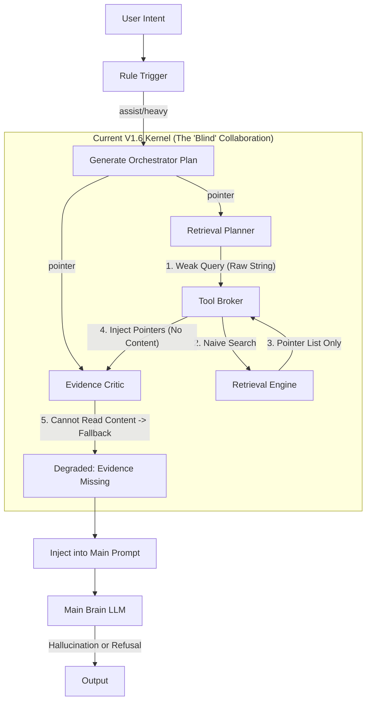

# V1.6 Architecture Review & Optimization Plan: Enhancing Worker Collaboration

> **Status**: Final Review
> **Date**: 2026-02-10
> **Target**: Resolve the issue where "2~3 workers fail to significantly enhance the Main Brain" and upgrade from "Running" to "Commercial Grade".

---

## A. System Snapshot (Current Reality)

The current V1.6 architecture implements a "Single Session Collaboration Kernel" but suffers from data loss at critical junctions.

**Critical Failure Points**:
1.  **W1 -> Broker**: Transmits unstructured "intent text" instead of precise retrieval commands (symbols/paths).
2.  **Broker -> W2**: Returns file paths (Pointers) without snippets. The Critic has no permission/ability to "read" the content, rendering it blind.

---

## B. Top 10 Issues (Root Cause Analysis)

| Priority | Root Cause | Visible Symptom | Impact |
| :--- | :--- | :--- | :--- |
| **P0** | **Retrieval Query Regression**: `retrieval_planner` only passes raw `intent` string, failing to generate structured queries. | Workers run, but the Main Brain answers vaguely as if no research was done. | **Quality**: Near-zero retrieval hit rate breaks the entire chain. |
| **P0** | **Critic Blindness**: Broker returns `path` pointers. Critic cannot read file bodies and reports "Evidence Missing". | System retries repeatedly, eventually degrading to "Insufficient evidence". | **Latency/Quality**: Wasted retries; forced degradation. |
| **P0** | **Low Information Density in TopK**: TopK is often filled with "similar filename" noise instead of relevant code. | Main Brain cites wrong code snippets or hallucinates based on noise. | **Hallucination**: Reasoning based on bad data. |
| **P1** | **Impoverished Prompts**: Worker System Prompts are single sentences, lacking Chain-of-Thought guidance. | Unstable output formats (sometimes JSON, sometimes raw notes). | **Stability**: High parsing failure rate leads to fallbacks. |
| **P1** | **Rigid Retry Logic**: Critic blindly triggers the same retrieval again upon failure, without strategy adjustment. | TUI shows "Thinking..." for 15s+, resulting in no new information. | **Latency**: Wasted compute and time. |
| **P1** | **Patch Planner is a Stub**: Only outputs generic "I will modify code" text, not a strategic plan. | Complex refactoring tasks result in disordered steps or regressions. | **Capability**: Fails to lift the ceiling for complex tasks. |
| **P2** | **Prompt Interference**: Injected `<orchestrator>` blocks contain raw debug info, distracting the Main Brain. | Main Brain leaks internal terms like "According to orchestrator..." in replies. | **UX**: Verbose and "bot-like" responses. |
| **P2** | **Observability Black Box**: Lack of "Input-Process-Output" snapshots for single turns makes debugging guesswork. | Developers cannot quickly pinpoint if it's a retrieval failure or model failure. | **Maintenance**: Long debugging cycles. |
| **P2** | **Crude Budget Control**: Token counting ignores "Information Entropy", filling context with trash. | Model becomes "dumber" in long conversations due to context pollution. | **Cost**: Wasted tokens. |
| **P2** | **No Feedback Loop**: Failed retrieval has no mechanism to "try a different keyword". | Single search failure leads to total task failure. | **Success Rate**: Low robustness. |

---

## C. Optimization Options

| Dimension | **Option A: Conservative Fix** | **Option B: Structured Enhancement (Recommended)** | **Option C: Radical Agentic** |
| :--- | :--- | :--- | :--- |
| **Concept** | Fix bugs to let Critic see files; keep architecture as-is. | **Define Structured Interfaces**; treat Workers like API callers. | Turn Workers into full Agents with memory/tools. |
| **Retrieval** | String concatenation hacks. | **Protocol Upgrade**: Support `symbol`, `path`, `text` queries. | Autonomous tool selection (grep/lsp). |
| **Critic** | Inject summaries in Prompt. | **Payload Upgrade**: Broker returns `Snippet` (with body). | Autonomous file reading loop. |
| **Gain** | Fixes errors, limited capability gain. | **High retrieval precision & verification depth**. | Highest capability, but uncontrollable cost/latency. |
| **Cost** | Low (3 days) | **Medium (10 days)** | Very High (30+ days) |
| **Risk** | Band-aid solution. | Requires `protocol` & `tool-broker` changes. | Latency explosion. |

---

## D. Recommended Plan (Option B) & Roadmap

**Core Strategy**: Maintain "Single Session" architecture but refactor **Worker Protocols** and **Prompt Strategies**. Upgrade Workers from "pass-throughs" to "structured processors".

### **Phase 1: Structured Protocols (First 7 Days)**
*   **M1.1 Structured Query**: Upgrade `retrieval_planner` output from `string` to `{ type: 'symbol'|'text', query: string, context?: string }`.
*   **M1.2 Broker Upgrade**: Enable `tool-broker` to handle Symbol/Path precise retrieval, not just full-text search.
*   **M1.3 Curing Blindness**: Broker MUST return **Top 5 Snippets (with line numbers & content)** to the Critic, not just paths.

### **Phase 2: Prompt & Strategy Upgrade (Next 23 Days)**
*   **M2.1 Multi-Layer Prompts**: Implement `Role + Task + Format + FewShot` 4-layer prompts for all Workers.
*   **M2.2 Smart Retry**: Critic generates "Feedback/Suggestions" for the second retrieval attempt instead of blind retries.
*   **M2.3 Strategic Patch Planner**: Enforce `<Step><Check><Rollback>` output structure for the Patch Planner.

---

## E. Executable Task List (Prioritized)

1.  **[Protocol] Upgrade `LlmWorkerResult` Schema**: Add `StructuredQuery` definition (Symbol/Text/Path).
2.  **[Retrieval] Refactor `retrieval_planner.ts`**:
    *   Add Few-Shot examples to Prompt to teach query generation.
    *   Implement structured output logic.
3.  **[Broker] Refactor `tool-broker.ts`**:
    *   Map structured queries to underlying search engine parameters.
    *   **Crucial**: Fetch file snippets (`read_file` / `snippet_extract`) and populate `pointers.snippets`.
4.  **[Critic] Refactor `evidence_critic.ts`**:
    *   Consume `pointers.snippets`. Add "Verify claims based on snippets" instruction to Prompt.
    *   Output specific "missing info descriptions" in degradation logic.
5.  **[Observability] Enhanced Logs**: Record exact Search Query and Top 3 Hit Paths in `events.jsonl`.

---

## F. Risks & Rollback

*   **Risk 1: Token Inflation**
    *   *Mitigation*: Strict length limit on Snippets (e.g., max 200 chars/snippet). Monitor `segments.evidence` size.
*   **Risk 2: Structured Parsing Failure**
    *   *Mitigation*: Keep Text Search as fallback. If parsing fails, revert to string search.
*   **Rollback**:
    *   Gate new logic behind `OPENCODE_EXPERIMENTAL_STRUCTURED_WORKER`.
    *   Immediate disable if metrics (Critic degradation rate) worsen.

---

## G. Evidence Needed (Gap Analysis)

1.  **Raw Broker Logs**: Need to see the actual Search Query string used by `runRetrieval` (currently a black box).
2.  **Retrieval Hit Rate**: Need manual inspection of Top 20 results for a few cases to measure relevance.
3.  **Critic Prompt Snapshot**: Need to verify the exact text injected into the Critic's context at runtime.
