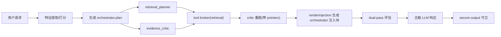

# V1.6 主脑-小脑协作链路诊断报告（真实回放）

- 日期：2026-02-10
- 诊断对象：V1.6 单 Session（主脑 + retrieval_planner + evidence_critic + patch_planner）
- 诊断方式：基于真实会话证据回放（非理论推演）
- 结论先行：链路已打通，但“证据有效载荷”不稳定，导致小脑经常只给主脑“缺证据”信号，增强效果不稳定。

---

## 0. 执行摘要（给评审先看）

1. **协作机制已实际发生**：本次会话里小脑有真实启动、执行、重试、工具代理、回注入主脑，不是“没触发”。
2. **核心问题不在触发，而在喂料质量**：retrieval 返回了 20 条命中，但回传给 critic 的 topK 里大多是“路径级片段”，不是可判定条款正文，critic 仍会降级。
3. **主脑确实读取了小脑结果**：小脑输出通过 `<orchestrator>...</orchestrator>` 注入到主脑 system；但注入内容偏“状态描述”，缺少高价值证据摘要时，增强收益有限。
4. **本轮并非架构失效，而是链路中段质量不足**：应优先优化“retrieval query 质量 + topK 选择策略 + critic 输入载荷”，再谈模型切换与更复杂编排。

---

## 1. 诊断范围与证据样本

### 1.1 会话与消息

- 会话：`ses_3b94395d0ffeC634iIBFEBTwWj`
- 目标消息：`msg_c46bc6a4c001nkCj9853ZDTii3`
- 事件日志：`.opencode/evidence/local/default/ses_3b94395d0ffeC634iIBFEBTwWj/events.jsonl`

### 1.2 本轮用户任务（原意图）

来自 retrieval spec（raw intent）：

- “请执行一次证据优先的业务判定，输出结论与引用，不要执行命令或脚本，不要创建子会话。”

证据文件：
- `.opencode/artifacts/local/default/ses_3b94395d0ffeC634iIBFEBTwWj/retrieval/01KH3C2VYPC2WC1CXPG04CHYBY/retrieval.spec.json`

---

## 2. 端到端链路复现（真实时间线）

### 2.1 关键事件（节选）

- `08:53:10` `orchestrator.planned`
- `08:53:10` `retrieval_planner`/`evidence_critic` 进入 `planned -> running`
- `08:53:10` retrieval_planner `completed`（给出 retrieval 请求）
- `08:53:28` evidence_critic `degraded`（缺证据）
- `08:53:28` `tool_broker.requested`（2 个 retrieval）
- `08:53:28` 两个 retrieval 均 `cache_hit` 且 `summary total=20`
- `08:53:28` evidence_critic 重跑 `planned -> running`
- `08:53:51` evidence_critic 再次 `degraded`
- `08:53:51` orchestrator `fallback=draft; worker status degraded`
- `08:54:24` secure_output `degraded`

同一 message 统计（该轮明显有重试循环）：
- `orchestrator.worker.lifecycle`: 54
- `orchestrator.planned`: 6
- `tool_broker.requested`: 6
- `retrieval.started`: 20（多数 cache hit）

---

## 3. 小脑到底“收到了什么 / 做了什么 / 产出了什么”

## 3.1 输入：Role Pack（真实）

来源：
- `.../workers/retrieval_planner/role-pack.json`
- `.../workers/evidence_critic/role-pack.json`

共同字段：
- `policy: { mode: "balanced", unknown: "deny" }`
- `budget: { timeoutMs: 15000, maxOutputTokens: 32000, maxToolCalls: 4 }`
- `planPointer`: 指向 `orchestrator.plan.json` + 用户 intent

差异：
- retrieval_planner 初始 `pointer_count = 0`
- evidence_critic 重跑时 `pointer_count = 12`（含 case JSON + snippets）

## 3.2 系统提示词（代码原文）

- retrieval_planner：`packages/opencode/src/session/orchestrator/workers/retrieval-planner.ts`
  - `You are retrieval_planner. Return JSON only. Generate focused retrieval requests for missing evidence.`
- evidence_critic：`packages/opencode/src/session/orchestrator/workers/evidence-critic.ts`
  - `You are evidence_critic. Return JSON only. Keep output concise. If evidence is missing, request retrieval.`
- patch_planner：`packages/opencode/src/session/orchestrator/workers/patch-planner.ts`
  - `You are patch_planner. Return JSON only ... Never emit code fences, shell commands...`

## 3.3 输出：Worker Result（真实缓存）

retrieval_planner（ok）主要输出：
- note：缺少可检查来源
- toolRequests：请求 retrieval（输入为 planPointer + intent）

evidence_critic（degraded）主要输出：
- note：Evidence missing / No evidence was accessible
- toolRequests：继续请求 retrieval（首次有，重跑后无）

证据：
- `.opencode/cache/store/orchestrator-worker/entries/b15359cd...json`
- `.opencode/cache/store/orchestrator-worker/entries/d5304d36...json`
- `.opencode/cache/store/orchestrator-worker/entries/8dbf951f...json`

---

## 4. 小脑结果如何进入主脑

链路位置：

1. `runOrchestratorTurn` 并发执行 worker
2. 聚合 `workerResults` + `tool broker summary` + `pointers`
3. `renderInjection` 组装 `<orchestrator>...</orchestrator>`
4. 经 dual-pass 决策后，追加到主脑 system

核心代码：
- 注入拼装：`packages/opencode/src/session/orchestrator/index.ts`（`renderInjection`）
- 注入进入主脑：`packages/opencode/src/session/orchestrator/index.ts`（`system: [...input.system, dualPass.text]`）
- 主脑实际消费：`packages/opencode/src/session/processor.ts`（`LLM.stream(orchestratedInput)`）

> 结论：小脑结果不是替换主脑，而是作为系统级协作上下文追加给主脑。

---

## 5. 本次链路问题清单（按优先级）

### P0（先修）

1. **检索 query 退化为 planPointer 字符串查询**
   - toolRequests 输入是 `planPointer + intent`，语义过于粗糙，导致命中结构化证据条款能力弱。

2. **topK 片段信息密度低**
   - broker 回传 topK 指向的 snippets 主要是“文件路径行”，不是可判定条款正文。
   - 结果：critic 即便重跑，仍认为“无可判定证据”。

3. **evidence_critic 输入缺“可判定证据块”保障**
   - 目前只依赖 `workingSet.pointers`，缺少“必须包含规则条款正文 + 案例关键字段”的输入门槛。

### P1（建议尽快）

4. **同一消息重复编排次数偏高，TUI 观感像循环**
   - 一条 message 出现 6 轮 planned，用户观感差，且额外消耗算力。

5. **观测可见性仍不足**
   - 虽有 lifecycle 与 artifacts，但缺“单轮 worker 请求/响应摘要单文件”，排障仍需拼日志。

6. **secure-output 与 orchestrator 协作断层**
   - 最终因缺 `assistant_claims_json` 被守卫降级，说明“协作层 -> 输出守卫层”之间的结构化断言衔接还不完整。

---

## 6. 小脑职责定位复审（建议）

### 6.1 当前定位

- `retrieval_planner`：决定“找什么证据”
- `evidence_critic`：判断“证据是否足够、是否冲突”
- `patch_planner`：代码策略规划（heavy 路径）

### 6.2 建议升级后的职责边界

- retrieval_planner：
  - 负责把用户意图拆成“证据清单模板”（规则类、事实类、冲突类）
  - 输出必须包含：目标路径模式、字段键、判定目的

- evidence_critic：
  - 只做“证据充分性与冲突审查”，不做最终业务结论
  - 输出结构固定：`sufficient/insufficient + missing_paths + conflict_pairs + confidence`

- 主脑：
  - 负责最终结论表达与面向用户解释
  - 必须消费 critic 的结构化结果（而不是仅消费自然语言 note）

---

## 7. 可执行优化方案（两周内）

### Sprint A（稳定协作，先把增强做实）

1. 改 retrieval_planner toolRequests 的输入模板
   - 从“planPointer字符串”升级为“结构化检索意图（rules/facts/constraints）”。

2. 改 retrieval topK 选取策略
   - 优先正文片段（含条款句子），禁止路径名片段挤占 topK。

3. 改 critic 重跑门槛
   - 若未拿到“规则正文 + 案例关键字段”，直接标记 `insufficient` 并给缺失路径，不再盲重跑。

### Sprint B（可观测与防回归）

4. 为每轮 worker 新增 `worker-io-summary.json`
   - 记录：输入摘要、系统提示词版本、输出摘要、注入摘要。

5. 新增回归门禁
   - 场景：证据优先任务必须拿到非空条款正文引用；否则用例 fail。

---

## 8. 验收指标（量化）

- `critic_degraded_rate`：证据优先类请求中，critic 降级率 < 15%
- `useful_pointer_rate`：回注指针中“正文片段占比” > 80%
- `rerun_count_per_message`：同一 message orchestrator 重跑次数 <= 2
- `citation_coverage`：最终回答条款引用覆盖率 > 90%
- `secure_output_pass_rate`：证据优先场景守卫通过率 > 95%

---

## 9. 对“系统提示词只有一句话”与“是否共享”的结论

1. **一句话提示词能跑通，但不足以稳定高质量**。
   - 现在能工作，但在边界场景里容易“只会说缺证据”，不够强健。

2. **小脑提示词不与主脑共享**。
   - 小脑各自有独立 system prompt；主脑不会直接拿到小脑完整提示词。
   - 主脑只接收小脑产出（notes/toolRequests/pointers 注入结果）。

3. **建议引入“多层提示词”**。
   - 角色层（职责）+ 约束层（禁止项/降级策略）+ 输出层（严格结构）+ 评估层（成功判据）。

---

## 10. 附录：关键证据路径索引

- 会话事件：
  - `.opencode/evidence/local/default/ses_3b94395d0ffeC634iIBFEBTwWj/events.jsonl`
- orchestrator 产物：
  - `.opencode/artifacts/local/default/ses_3b94395d0ffeC634iIBFEBTwWj/orchestrator/01KH3BRWMHV5GHMAJ5MZXDX807/orchestrator.plan.json`
  - `.opencode/artifacts/local/default/ses_3b94395d0ffeC634iIBFEBTwWj/orchestrator/01KH3BRWMHV5GHMAJ5MZXDX807/orchestrator.features.json`
- worker role pack：
  - `.../workers/retrieval_planner/role-pack.json`
  - `.../workers/evidence_critic/role-pack.json`
- tool broker 指针：
  - `.opencode/artifacts/local/default/ses_3b94395d0ffeC634iIBFEBTwWj/tool-broker/msg_c46bc6a4c001nkCj9853ZDTii3/0001-retrieval.pointer.json`
  - `.opencode/artifacts/local/default/ses_3b94395d0ffeC634iIBFEBTwWj/tool-broker/msg_c46bc6a4c001nkCj9853ZDTii3/0002-retrieval.pointer.json`
- retrieval 命中：
  - `.opencode/artifacts/local/default/ses_3b94395d0ffeC634iIBFEBTwWj/retrieval/01KH3C2VYPC2WC1CXPG04CHYBY/hits.json`
- secure-output 降级证据：
  - `.opencode/artifacts/local/default/ses_3b94395d0ffeC634iIBFEBTwWj/secure-output/msg_c46c128b2001UXd7orSsfEQ0dL.error.json`

